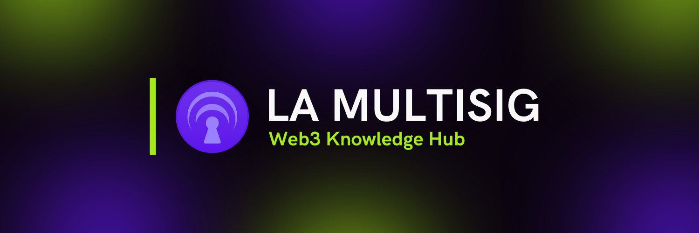

# La Multisig Wiki 🧠

<p align="center">
  
</p>

## Sobre La Multisig 🧠

La Multisig es un hub de conocimiento Web3 enfocado en LATAM, dedicado a educar y empoderar a la comunidad hispanohablante en el ecosistema blockchain y las finanzas descentralizadas. Nuestro objetivo es hacer que la tecnología blockchain sea accesible para todos, proporcionando recursos educativos de alta calidad en español.

## La Wiki 📖

Esta wiki es una plataforma de documentación open-source construida con Next.js y [Fumadocs](https://fumadocs.vercel.app), diseñada para proporcionar:

- 📝 Guías completas sobre blockchain y Web3
- 🔐 Recursos de seguridad y mejores prácticas
- 💰 Información sobre DeFi y criptomonedas
- 🌐 Explicaciones sobre diferentes ecosistemas blockchain
- 🛠️ Tutoriales prácticos y casos de uso

### Estructura del Contenido

```
content/docs/
├── bitcoin/       # Todo sobre Bitcoin
├── bridges/       # Puentes entre blockchains
├── defi/          # Finanzas descentralizadas
├── ecosistemas/   # Diferentes blockchains
├── privacidad/    # Guías de privacidad
├── seguridad/     # Seguridad en Web3
├── stablecoins/   # Sobre stablecoins
└── wallets/       # Gestión de wallets
```

## Desarrollo Local 💻

Para ejecutar el proyecto localmente:

```bash
# Instalar dependencias
pnpm install

# Iniciar servidor de desarrollo
pnpm dev

# Construir para producción
pnpm build
```

Abre [http://localhost:3000](http://localhost:3000) en tu navegador para ver el resultado.

## Contribuir 🤝

¡Nos encantaría contar con tu ayuda! Si deseas contribuir:

1. Lee nuestra [guía de contribución](CONTRIBUTING.md)
2. Revisa nuestro [código de conducta](CODE_OF_CONDUCT.md)
3. Crea un fork del repositorio en [lamultisig/lamultisig-wiki](https://github.com/lamultisig/lamultisig-wiki)
4. Crea una rama para tus cambios
5. Envía un pull request

## Licencias 📄

Este repositorio utiliza un sistema de licencias dual:

1. **Código Fuente** (archivos de configuración, scripts y otros componentes de software):
   - Licenciado bajo Apache License 2.0
   - Ver archivo [LICENSE](LICENSE)

2. **Contenido** (documentación, artículos, tutoriales y materiales educativos):
   - Licenciado bajo Creative Commons Attribution-ShareAlike 4.0 International
   - Ver archivo [CONTENT_LICENSE](CONTENT_LICENSE)

"La Multisig" y el logotipo de La Multisig son marcas registradas y su uso requiere autorización previa por escrito.

## Comunidad 🌎

- [Twitter](https://twitter.com/lamultisig)
- [Telegram](https://t.me/lamultisig)
- [Website](https://lamultisig.xyz)

## Apoya el Proyecto ❤️

Si encuentras útil este proyecto, por favor considera:
- Darle una ⭐️ en GitHub
- Compartirlo en redes sociales
- Contribuir con contenido o código
- Reportar errores o sugerir mejoras
